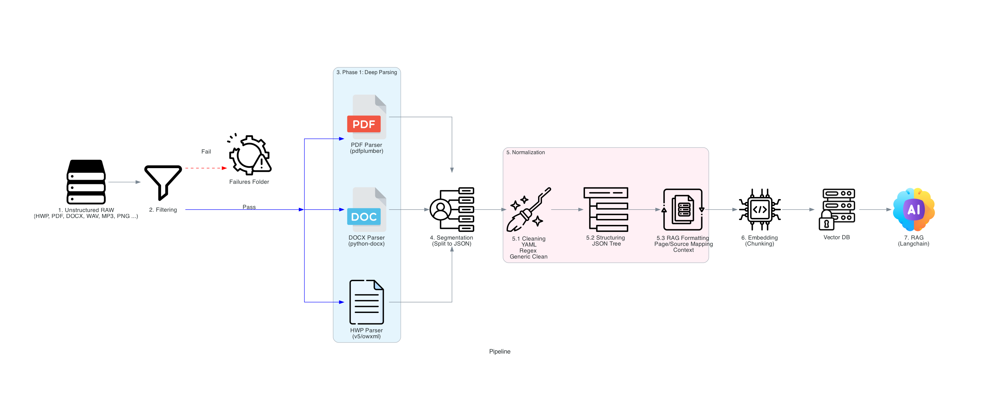

# law-rag-pipeline

**2026/01 기준 현재 실험·설계 중:**  
이 프로젝트는 **비정형 데이터(특히 법률/계약 문서 등)**를  
자동 전처리·정제·정규화하여  
**LangChain 기반 RAG(Retrieval-Augmented Generation) 파이프라인**에서  
바로 활용할 수 있는 구조의 데이터로 변환하는 것을 목표로 합니다.

---

## 🎯 최종 목적

> **비정형 문서 → 자동 전처리 파이프라인 → RAG-ready 데이터 →  
LangChain RAG 연계 워크플로 구축**

- 다양한 원본 문서(docx, pdf, hwp 등)를
- parsing → segmentation → cleansing → normalization 단계를 거쳐
- **LangChain/RAG pipeline**(벡터DB/검색/생성형 QA 등)에 최적화된 JSON(또는 텍스트/메타) 구조로 자동 변환


---

## 주요 기능/개발 구조

- **모듈별 책임 분리와 단계적 자동화**  
  : parsing, segmentation, cleansing, normalization 완전 분리
- **실제 데이터-코드/메타/폴더화 설계**  
  : data/raw, data/normalization 등 단계별 저장소 관리
- **실험/설계/정책 반영 실시간 진행**  
  : 다양한 문서/고객사/정책 케이스별로 구조와 룰북 실험

---

## 폴더 구조 예시
```
law-rag-pipeline/
├── README.md               # 시스템 아키텍처 및 파이프라인 가이드
├── app.py                  # 메인 실행 엔트리포인트
├── assets/                 # pipeline.png 등 문서용 이미지
├── data/                   # [Data Lake] 단계별 데이터 저장소
│   ├── raw/                # 최초 수집 원본 (Dirty Raw)
│   ├── preprocess/         # 1차 필터링 및 파일 무결성 검증
│   │   ├── raw_clean/      # 필터 통과 원본
│   │   └── failures/       # 실패 파일 (extension, size, corrupt 등 분류)
│   ├── parsed_raw/         # Phase 1: 포맷별 JSON 추출 결과 (날짜별)
│   ├── segmentation/       # Phase 2: 조각화(Segment) 완료된 JSON
│   └── normalization/      # Phase 3: 최종 정제 및 RAG 최적화 데이터
│       └── 20260112_...    # 타임스탬프 기반 관리 (01_Cleansed 등)
├── src/                    # [Source Code] 핵심 로직
│   ├── preprocessing/      # 2. Filtering 단계 (raw_cleaner.py)
│   ├── parsing/            # 3. Deep Parsing (PDF, HWP, DOCX 전용 파서)
│   ├── segmentation/       # 4. Segmentation (문서 조각화 로직)
│   ├── normalization/      # 5. Normalization (가장 핵심적인 정제/구조화)
│   │   ├── cleanser/       # 5.1 Cleaning (Generic, PDF, HWP 전용 클렌저)
│   │   │   └── rules/      # 세분화된 YAML 배치
│   │   ├── structurer/     # 5.2 Structuring (계층 구조화 예정)
│   │   └── rag_formatter/  # 5.3 RAG Formatting (메타데이터 태깅 예정)
│   ├── pipelines/          # 전 공정 자동화 워크플로우 (full_pipeline.py)
│   └── rag/                # 6 & 7. VectorDB 및 RAG 연동부 (예정)
└── experiments/            # 실험 로그 및 벤치마크 결과
```
---

## 현재 상태

- ✅ **Infrastructure**: 폴더 구조, 자동화 스켈레톤 구축 완료
- ✅ **Phase 1 & 2**: 포맷별 Deep Parsing 및 Segmentation 완료
- ✅ **Normalization (Phase3.1)**: 포맷별 YAML 정책 기반의 Generic/Specific Cleaning 완료
- 🚧 **Current Task**: **Phase 3.2 Structuring** (계층 구조화 및 페이지 매핑) 진입 중

---

## 개발자 정보

- 개발자 : Choi Bo Gyeong
- E-mail : cbg1704@gmail.com

---

**본 레포는 진행 중(Working in progress)이고,  
모든 정책/코드/구조/룰은 계속 진화·확장될 예정입니다.**